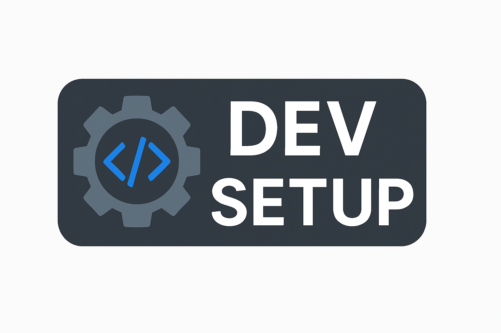

# 🚀 Script d'installation : Environnement de développement web complet (config Romain)

Bienvenue dans ton setup automatisé pour un environnement de développement **full stack web** sous Ubuntu !

Ce script permet d'installer tous les outils nécessaires pour être rapidement opérationnel avec une configuration stable, moderne et professionnelle.

---

## 📄 Contenu du script

Ce script installe et configure automatiquement :

### 🔧 Outils de développement :

- Node.js (via NVM), npm, yarn, pnpm
- Docker + Docker Compose
- MongoDB 7 (via dépôt officiel)
- MariaDB (alternative à MySQL)
- Git + outils de base (curl, wget, unzip, etc.)

### 🖥 VS Code (via Snap) avec extensions :

- Prettier, ESLint
- GitLens, Live Server
- Tailwind CSS IntelliSense, Path Intellisense
- Material Icon Theme

### ⏳ Terminal optimisé :

- Starship prompt (rapide, personnalisable)
- Fastfetch (affichage système stylé au démarrage)
- Bash + Zsh + Oh My Zsh (tu peux choisir ton shell préféré)

### 📁 Structure de projet automatique :

Crée le dossier `~/Documents/dev/` avec les sous-dossiers :

```
frontend/      # projets front React / Next.js
backend/       # APIs Express / Nest.js
fullstack/     # apps complètes
sandbox/       # projets tests
templates/     # bases réutilisables
```

### 🔐 Aliases bash utiles

Voici la liste complète des alias installés automatiquement :

```bash
# 🔁 Alias personnalisés
gb='gedit .bashrc'                # Édite le fichier .bashrc
al='alias'                        # Affiche tous les alias enregistrés

# Recherche de paquets
as='apt-cache search'            # Recherche un paquet dans les dépôts
vp='dpkg -l | grep'              # Vérifie si un paquet est installé
pi='dpkg -l > ~/Bureau/paquets_installés.txt'  # Sauvegarde la liste des paquets installés

# Installation et suppression
it='sudo apt update && sudo apt install'
ri='sudo apt update && sudo apt reinstall'
rv='sudo apt remove'
pu='sudo apt purge'

# Mise à jour et nettoyage
ul='apt list --upgradable'
up='sudo apt update && sudo apt upgrade'
ar='sudo apt autoremove'
ac='sudo apt autoclean'

# Git & navigation
ll='ls -lah --color=auto'
gs='git status'
ga='git add .'
gc='git commit -m'
dev='cd ~/Documents/dev'
c='clear'
restart-docker='sudo systemctl restart docker'
```

### 💡 Accéder aux alias

Ils sont ajoutés dans le fichier `~/.bashrc`. Pour les consulter ou les modifier :

```bash
gedit ~/.bashrc  # ou nano ~/.bashrc
```

Pour un simple affichage de la liste des alias :

```bash
al
```

Puis recharge ton terminal :

```bash
source ~/.bashrc
```

---

## 🚀 Installation rapide

### ✅ Méthode recommandée : commande unique

```bash
bash <(curl -s https://raw.githubusercontent.com/ton-pseudo/env-dev-web-romain/main/install-dev-romain.sh)
```

> Remplace `ton-pseudo` par ton nom d'utilisateur GitHub si tu clones ce dépôt.

### 📁 Méthode classique : clone Git

```bash
git clone https://github.com/ton-pseudo/env-dev-web-romain.git
cd env-dev-web-romain
chmod +x install-dev-romain.sh
./install-dev-romain.sh
```

---

## 🚫 Prérequis

- Distribution Ubuntu (22.04 ou supérieur recommandé)
- Un accès sudo
- Connexion internet

---

## 🚀 Et ensuite ?

### 🌐 Redémarre ta session ou ton PC :

Pour activer les changements de shell, Docker, etc.

### 📈 Teste tes outils

Vérifie que tout est installé correctement :

```bash
node -v
npm -v
yarn -v
pnpm -v
docker --version
mongo --version
code --version
```

### 🔍 Explore ta structure de dev :

```bash
cd ~/Documents/dev
ls -lah
```

---

## 📃 Licence

Ce projet est libre d'utilisation et de modification.

---

## ✨ Auteur : Romain

> Setup conçu pour un dev web moderne, minimaliste et efficace.  
> Bon code ! 🚀💻
